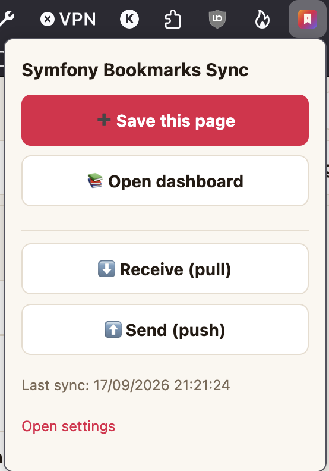
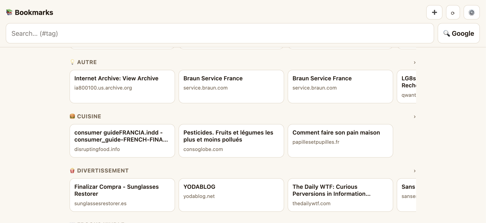
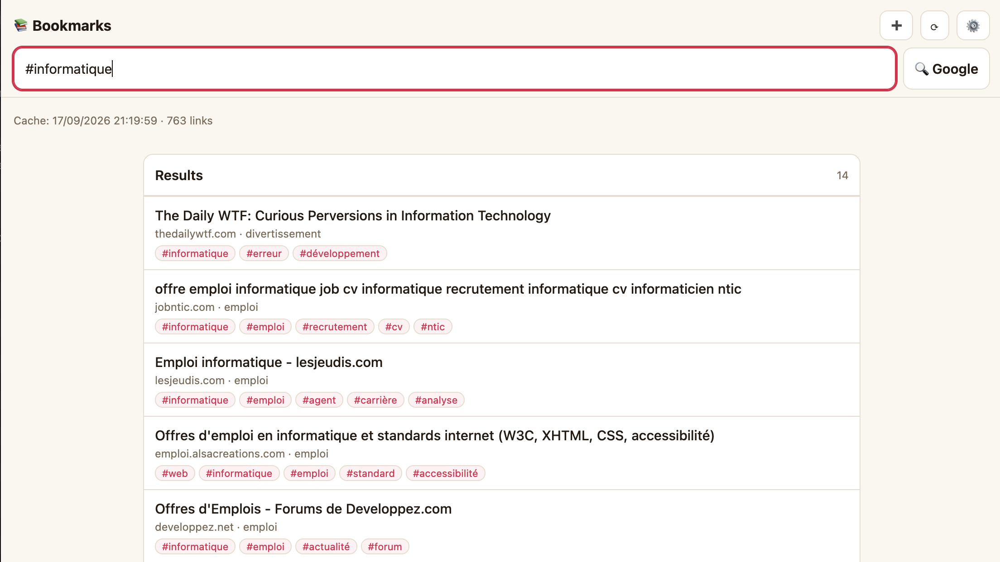
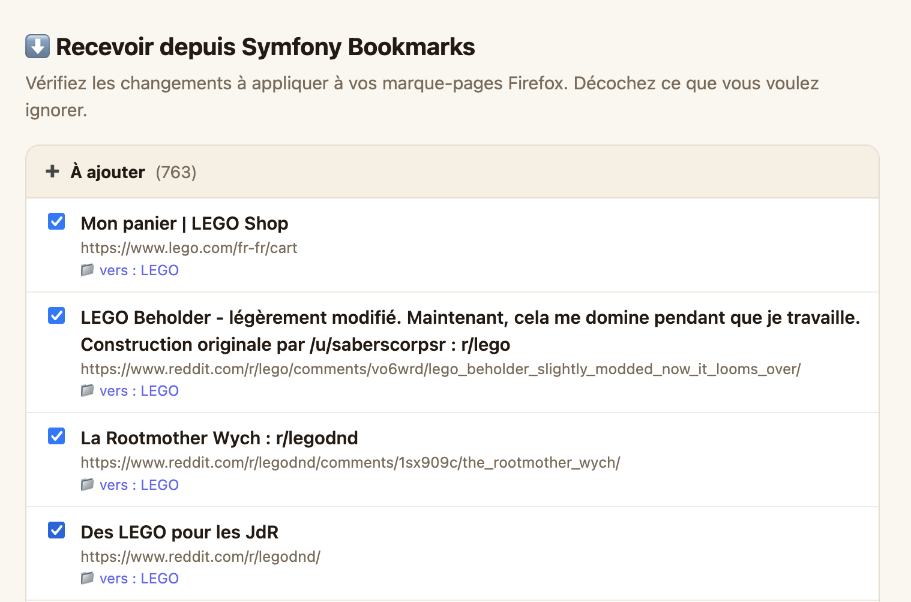

# Browser extension setup

## Symfony Bookmarks Sync (Firefox)

The dedicated **[Symfony Bookmarks Sync](https://addons.mozilla.org/fr/firefox/addon/symfony-bookmarks-sync/)**
add-on syncs your links two ways between the server and Firefox bookmarks. Install it
from AMO, then:

1. Open the extension options.
2. **Server URL**: `http://<your-instance>/` (e.g. `http://raspberrypi.local:8000`).
3. **Basic-auth user / password**: the htpasswd credentials that protect the app
   (the extension sends `Authorization: Basic …` on every request).
4. Pick a **dashboard** and where to import (Bookmarks Menu / Toolbar / Other), then
   **Save & pull** to review the first sync.

New links you add via the extension land in the app instantly and get archived on the
next cron tick. See `extension/README.md` for the full sync model.

## Firefox for Android

The extension also installs on **Firefox for Android** for configuration and the
connection test. Note that native bookmark sync is **desktop-only** — the
`browser.bookmarks` API doesn't exist on Android, so the sync buttons are disabled
there (an API-backed viewer is planned).

## Screenshots

**Toolbar popup** — save the current page, open the dashboard, or trigger a
Receive (pull) / Send (push):

**Dashboard** — browse your collections as folders:

**Tag search** — filter your links by `#tag`:

**Receive (pull) review** — check what to apply to your Firefox bookmarks before
writing anything:

